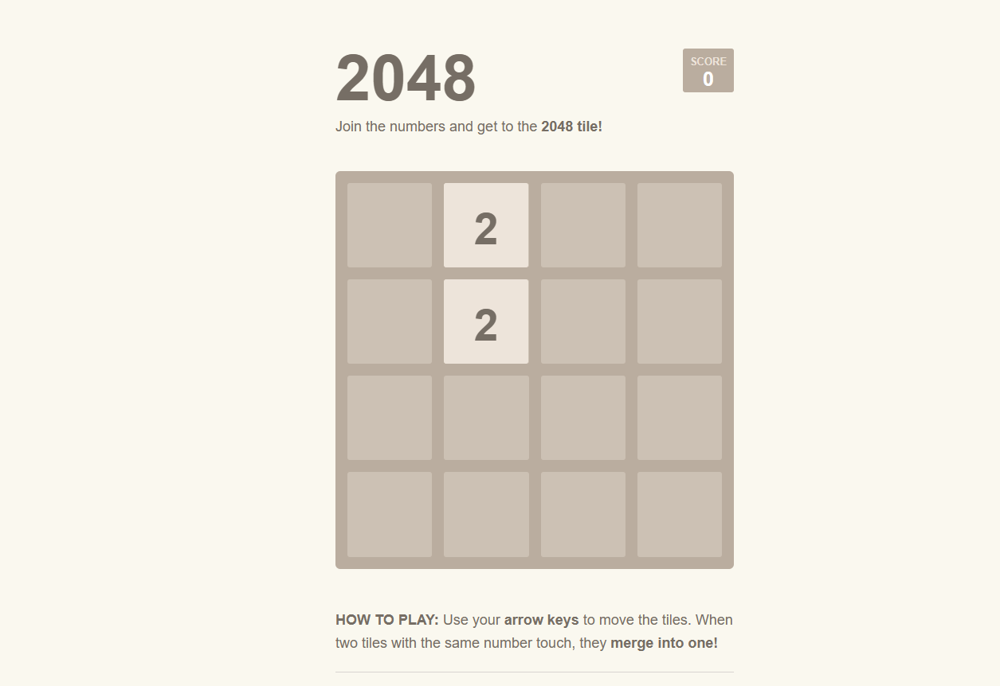

# 2048 Game

## Description

Welcome to the classic 2048 game! This repository contains the source code for a simple and addictive 2048 game implemented in JavaScript. The game is inspired by the popular mobile app and web game where players slide numbered tiles on a grid to combine them and create a tile with the number 2048.

## How to Play

The rules of the game are straightforward:

1. Use the arrow keys (up, down, left, right) to slide the tiles in the corresponding direction.
2. When two tiles with the same number collide, they merge into a new tile with their sum.
3. The goal is to reach the 2048 tile by combining tiles. The game ends when there are no more possible moves.

## Features

- Simple and intuitive gameplay, suitable for all ages.
- Responsive and interactive game interface.
- Score tracking to keep a record of your progress.
- Random tile generation for dynamic gameplay.
- Option to restart the game at any point.

## Getting Started

To play the game, you have several options:

1. Play the game online: [2048 Game](https://sameeravx.github.io/2048).
2. Clone the repository and run the game locally on your computer.

## Touch with me
Click Here : [https://sameeravx.github.io](https://sameeravx.github.io)
